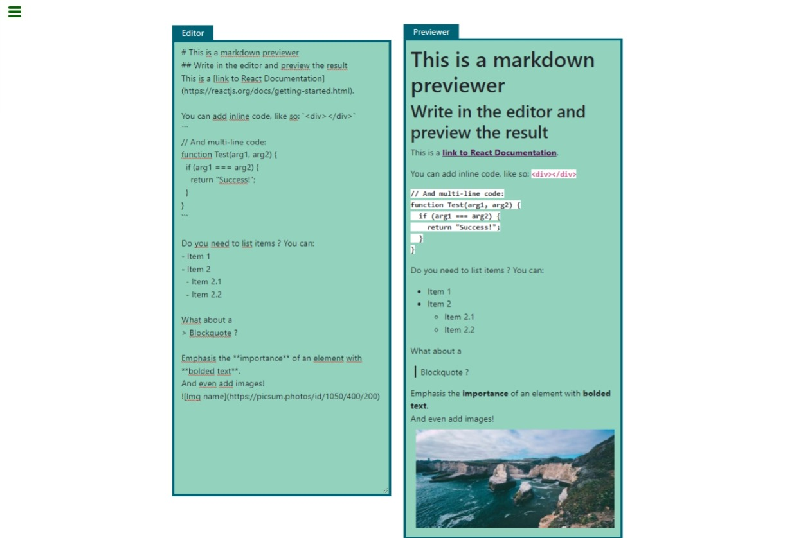

# Markdown previewer

The user writes in the editor and can preview the elements converted to markdown.
This project is the second final project for the Front End Development Librairies Certification of freeCodeCamp.

## Live site

- Live Site URL: [GitHub Page](https://ax-cd.github.io/markdown-previewer/)

## Description of the project

### Built with

- [React](https://reactjs.org/) - JS library
- CSS custom properties
- Bootstrap

### Challenges I faced and things I learned

- using dangerouslySetInnerHTML to render the element in the preview block: it wasn't working previously because I only had this.getMarkdownText and forgot this.state.editorInput.

```
<div dangerouslySetInnerHTML={this.getMarkdownText(this.state.editorInput)}/>
```

- using DOMPurify: I mostly struggle with the syntax, and **where** to integrate it in the code. I tried at first to put it with 'dangerouslySetInnerHTML' but it wasn't working. So I tried several places until it worked, and the solution was to place it in the function converting text into markdown.

```
  getMarkdownText = (editorInput) => {
    let __html = marked(editorInput, {__html: DOMPurify.sanitize(editorInput)});
    return { __html };
  };
```

- finally adding the defaultText: 1) the backquotes allow linebreaks and 2) an important detail to remember is to separate them with \ in the file

```
You can add inline code, like so: \`<div></div>\`
\`\`\`
// And multi-line code:
function Test(arg1, arg2) {
  if (arg1 === arg2) {
    return "Success!";
  }
}
\`\`\`
```

## Screenshot



## Links

- Frontend Mentor - [@Ax-cd](https://www.frontendmentor.io/profile/Ax-cd)
- Instagram - [@ax.coding](https://www.instagram.com/ax.coding/)

## Credits and resources

- [Marked Documentation](https://marked.js.org/) and particularly the [Advanced Usage Section](https://marked.js.org/using_advanced)

- ["Complete guide on React dangerouslySetInnerHTML" by Ruben Leija](https://linguinecode.com/post/complete-guide-react-dangerouslysetinnerhtml)

- [GitHub DOMPurify](https://github.com/cure53/DOMPurify)
